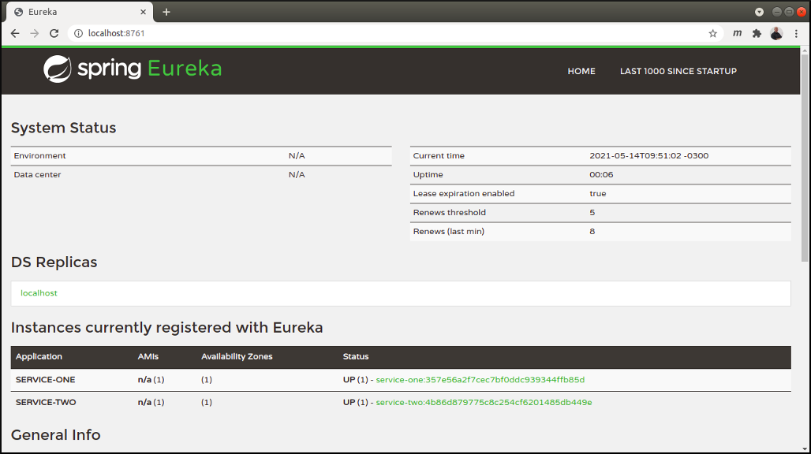

# SpringCloudEureka

## Description
Project that show how to implement a service discovery using the Spring Cloud Netflix Eureka.

## Technologies
The project use the following technologies:

* Java 11
* Apache Maven
* Project aggregation
* Spring Boot
* Spring Cloud Netflix Eureka
* IDE Eclipse

## Testing the project
**Step 1:** Start the microservices
* EurekaServer
* ServiceOne
* ServiceTwo

**Step 2:** Access Eureka Dashboard

```
http://localhost:8761
```



## Release History
* 1.0.0 (2021-05-15)
    * First version
